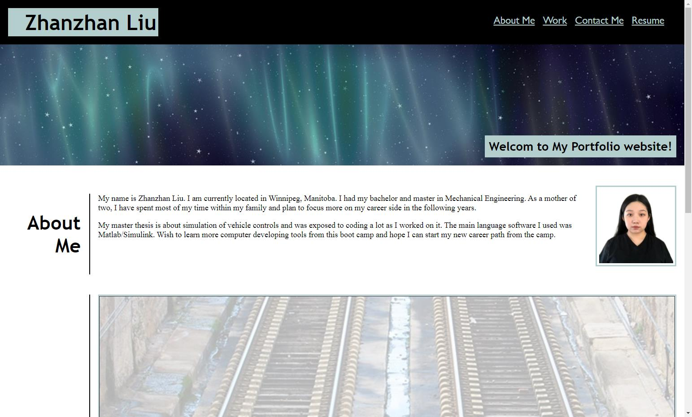
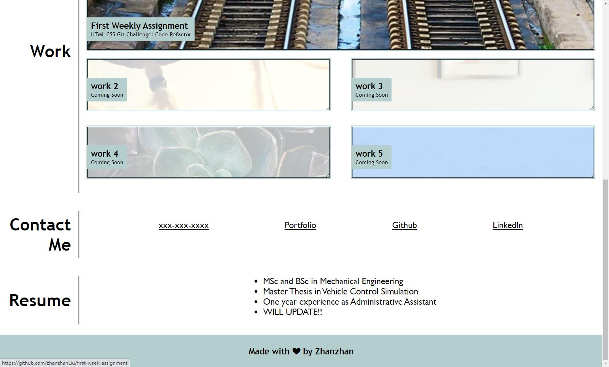

# Advanced CSS Challenge: Professional Portfolio - by Zhanzhan Liu

## Purpose
To make a deployed portfolio with work samples so that an employer can review the work and assess whether the candidate is good for an open position. The second weekly challenge is helping practicing all the HTML and CSS skills by creating a website from the start. 

## Build with
* HTML
* CSS

## Website
https://zhanzhanliu.github.io/Professional-Portfolio/

## Respository Link
https://github.com/zhanzhanLiu/Professional-Portfolio

## Screenshots of the webpage

## Future Work
* Enrich the biography in the about me section;
* Update the future projects to the work section;
* Add more details to resume part;
* Improve the layout for smaller screens
